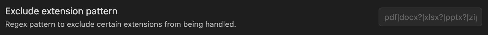
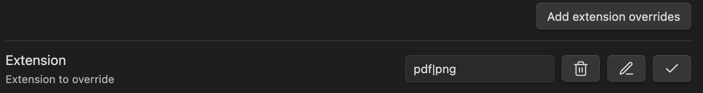

# Obsidian Attachment Management

This plugin supports more flexibly to setting your attachment location with variable like `${notepath}`, `${notename}`, `${date}` and `${md5}`. And a override setting feature can be use for change the global setting of a folder, file or extension.

> Read the [Original Name](#original-name) before using `${originalname}`.

## Roadmap of Features

This plugin currently supports:

- [x] Setting the attachment location with `${notepath}`, `${notename}`, `${date}` and `${parent}`
- [x] Auto-rename the attachment when paste file to `markdown` or `canvas`
- [x] Auto-rename the attachment file or folder while your rename the article (`markdown` or `canvas`) file
- [x] Auto-rename the attachment when drop file to `markdown` or `canvas`
- [x] Re-Arrange the attachment file that linked by `markdown` or `canvas` to corresponding path as you configured (experimental)
- [x] Processing duplicate attachment
  - [x] Processing duplicate attachment on craete (the first time, you paste or drop a attach in notes)
  - [x] Processing duplicate attachment on rename
- [x] Override attachment configuration for specified notes or folder
- [x] Exclude folder that your want to skip by this plugin
  - [x] Add Exclude folder by menu

## How to Install

- Install from Obsidian community plugins.
- Clone this repo
  - `npm i` to install dependencies
  - `npm run build` to start compilation in watch mode.
  - Copy the `main.js`, `manifest.json` and `style.css` files to your vault `VaultFolder.obsidian/plugins/obsidian-attachment-management`
- Downlaod the relaese file and unarchive the file to your vault `VaultFolder.obsidian/plugins/obsidian-attachment-management`

## Settings

The path of attachment is composed of three parts :

```
{root path}/{attachment path}/{attachment name}.extension
```

And you can use the variables below to config:

- `${notepath}`: The **directory** of the `markdown` or `canvas` file under the vault root.
- `${notename}`: The **filename** of the `markdown` or `canvas` file (without file extension).
- `${parent}`: The **parent** folder name of the `markdown` or `canvas` file.
- `${originalname}`: The **filename** of the attachment file when first time it created in obsidian.
- `${date}`: Date time format by [Moment format options](https://momentjscom.readthedocs.io/en/latest/moment/04-displaying/01-format)

> **Notice** before using `${originalname}`, there is soemthing you should know. This plugin will **not persist** the original name, it only use the filename to generate the attachment name on create event (first time added to obsidian). This means if you have used `${originalname}`, when you rearrange the attachemnt, there is no new name generated for the attachment, it just used the current name (i.e. change `Attachment format` from `asset-${originalname}` to `asset-1-${originalname}`, and use rearrange command, it's useless).

### Root Path to Save New Attachments

You must select a root folder to save the associated attachment of a `markdown` or `canvas` file.


It can be set use the config of obsidian in `Files & Links`, or reset in this option.

- Copy Obsidian settings: use the config of obsidian in `Files & Links`.
- In the folder specified below: set a fixed folder.
- Next to note in folder specified below: in the subfolder of current `markdown` or `canvas` file.

### Attachment Path

A sub-folder to place attachment under the `{root path}`, available variables:

- `${notepath}`: The **directory** of the `markdown` or `canvas` file under the vault root.
- `${notename}`: The **filename** of the `markdown` or `canvas` file (without file extension).
- `${parent}` : The **parent** folder name of the `markdown` or `canvas` file.

Default value `${notepath}/${notename}`.

### Attachment Format

Set how to rename the attachment, available variables:

- `${notename}`: The **filename** of the `markdown` or `canvas` file (without file extension).
- `${originalname}`: The **filename** of the attachment file when first time it created.
- `${date}`: Date time format by [Moment format options](https://momentjscom.readthedocs.io/en/latest/moment/04-displaying/01-format)
- `${md5}`: MD5 hash of the attachment file (only calculate when the attachment file was first created in vault).

default value `IMG-{date}`.

### Date Format

Use [Moment format options](https://momentjscom.readthedocs.io/en/latest/moment/04-displaying/01-format) to set the `${date}`, default value `YYYYMMDDHHmmssSSS`. You should always use the `${date}` variable to prevent the same file name.

#### Exclude Extension Pattern

This option is useful if you want to ignore some file type. Write a Regex pattern to exclude certain extensions from being handled.



### Automatically Rename Attachment

Automatically rename the attachment folder/filename when you rename the folder/filename where the corresponding md/canvas file be placed.

### Extension Override Setting

This feature allow you to specify the setting for a serials extension. You can use a regex pattern here, and override the global setting.



### Exclude Paths

If you want some path to be skipp by this plugin, add them to textarea.
If you have multi path, split them with semicolon ';'.

By default, the "Exclude paths" will only work on the folder you added and that folder contain at least one markdown file, you can toggle "Exclude subpaths" to exclude subpaths also.

> **The path is case sensitive and should not add leading slash '/' at begin.**

## Usage

Install and enable the plugin, after configuration you can paste or drop attachment file as usually and it will be auto renamed.

This plugin supports a command `Rearrange linked attachments/Rearrange all linked attachments`. If you run this command, it will rename all attachment (image file default, to rename other type you need to enable [Handle All Attachements](#handle-all-attachments)) that has been linked in `markdown` or `canvas` file as you configured.


**Notice**: The `Rearrange linked attachments/Rearrange all linked attachments` was currently a experimental feature, if you want to try out, it's better to back up your files at first.

### Overriding Setting

You can set the attachment path setting for file or folder. The priority of these setting are:

```
file setting > most close parent folder setting > global setting
```

If you want to reset the setting of files or folder to the global setting, use the command `Reset Override Setting` or the `Reset` button of override setting panel. By the way, **the reset will only working on each file or folder that you have set on**. The more appropriate method to handle the reset will be add in future.

### Original Name

The `${originalname}` represent the origianl filename (without extension) of attachment that your added to vault. For some reason, people want to keep the filename no to change or combine with other variable like `${date}`. If you want to keep the filename of an attach no to change, set the **Attachment Format** with `${originalname}` is enougth.

If you want to use `${originalname}` with other variables, like `${originalname}-${date}`. This plugin will persists the origianl name for future using. Suppose you change the **Attachment Format** from `${originalname}-${date}` to `IMG-${originalname}`, it's work fine.

The origianl name was stored in **data.json**, it's the configuration file of plugin, your can find it in `.obsidian/plugins/attachment-management/data.json`.

```json
  "originalNameStorage": [
    {
      "n": "Pasted image 20240113222517",
      "md5": "9B1546EBA299E1A2A2FC86C664A15073"
    }
  ],
```

As you can see the original name was saved with a hash, so if you add a same file multi-times only the last one will be save. The **originalNameStorage** will not clear automatically, use command `Clear unused original name storage`. This command will keep the entry if the hash of an attachment was matched.

### Known Issues

- ~~No support for processing duplicated file name right now (in develop). In backup, you could use the data variable [`x`](https://momentjscom.readthedocs.io/en/latest/moment/04-displaying/01-format/) to use Unix timestamp with millisecond as filename (it will prevent duplicated filename).~~
- When paste or drop a file in `canvas` and `markdown`, it's will delay to show the updated link/filename. The reason is the obsidian's api has no `paste` or `drop` event support for `canvas`, so I have implement in another way and this cause the delay of rename attachment.


- Suppose you have a structure below with default configuration:
  - attach directory, "assets/notes/hello/1.png"
  - article directory, "notes/Hello.md"
  - If you run `Rearrange ***` command may leading a error, since the folder was alerady exists but with letter case name.

## FAQ

Q: What if I add '/' to Exclude Paths?

A: It will exclude the whole vault folder.
