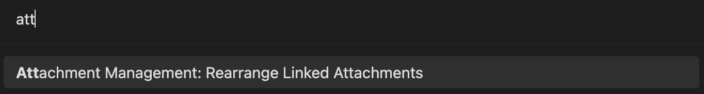
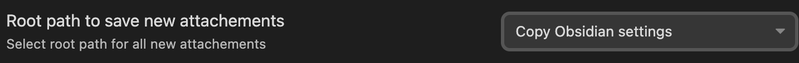
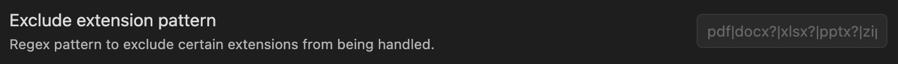
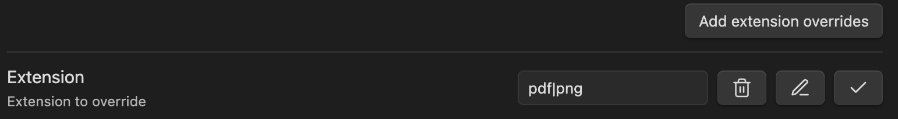
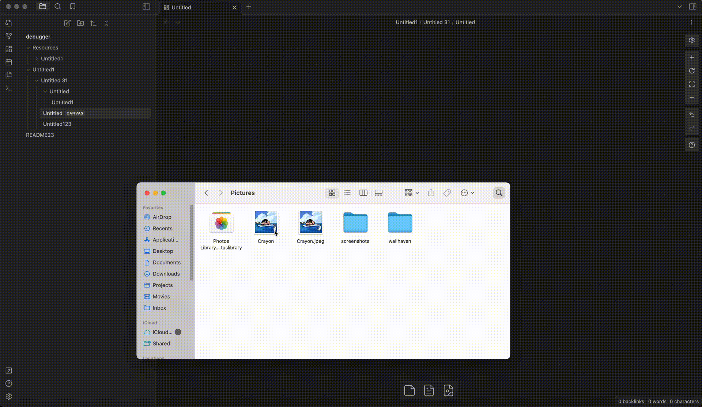

# Obsidian Attachment Management

This plugin supports more flexibly setting your attachment location with variables like `${notepath}`, `${notename}`, `${date}` and `${md5}`. An override setting feature can be used to change the global setting of a folder, file or extension.

> Read the [Original Name](#original-name) section before using the `${originalname}` variable. Read the [FAQ](#faq) section if you have any questions about how to use this plugin.

## Installation

- Install from Obsidian community plugins.
- Clone this repo
  - `pnpm i` to install dependencies
  - `pnpm run build` to start compilation in watch mode.
  - Copy the `main.js`, `manifest.json` and `style.css` files to your vault `VaultFolder.obsidian/plugins/obsidian-attachment-management`
- Download the release file and unarchive the file to your vault `VaultFolder.obsidian/plugins/obsidian-attachment-management`

## Usage

Install and enable the plugin, after configuration you can paste or drop attachment file as usually and it will be auto renamed.

This plugin supports a command `Rearrange linked attachments/Rearrange all linked attachments`. If you run this command, it will rename all attachments (image file default, to rename another type, you need to enable [Handle All Attachements](#handle-all-attachments)) that have been linked in the `markdown` or `canvas` file as you configured.



**Notice**: The `Rearrange linked attachments/Rearrange all linked attachments` is currently an experimental feature; if you want to try it out, it's best to back up your files first.

### Overriding Setting

You can set the attachment path setting for a file or folder. The priority of these settings are:

```
file setting > most close parent folder setting > global setting
```

If you want to reset the settings of files or folders to the global setting, use the command `Reset Override Setting` or the `Reset` button on the override setting panel. **The reset will only work on each file or folder that you trigger the command on**. A more appropriate method to handle resetting will be added in the future.

### Original Name

The `${originalname}` variable represents the filename (without extension) of the attachment at the moment it was first added to the vault. You can use it on its own (e.g. `${originalname}`) or combine it with other text and variables (e.g. `IMG-${originalname}-${date}`).

The plugin persists the original name in `data.json` under `originalNameStorage`, keyed by the file's MD5 hash. This means that even after the attachment has been renamed by the plugin or by a subsequent `Rearrange linked attachments` run, `${originalname}` will still resolve to the truly-original basename.

> **Note on duplicate content:** the storage is keyed by MD5, so two attachments with identical bytes share a single record. If you paste/drop two distinct files that happen to have the same content, only one original name will be retained for that md5; both files will resolve `${originalname}` to that same value.

Use the command **Clear unused original name storage** to prune entries whose file is no longer linked in the vault.

## Roadmap of Features

This plugin currently supports:

- [x] Setting the attachment location with `${notepath}`, `${notename}`, `${date}` and `${parent}`
- [x] Auto-rename the attachment when pasting to `markdown` or `canvas`
- [x] Auto-rename the attachment file or folder while you rename the article (`markdown` or `canvas`) file
- [x] Auto-rename the attachment when dropping to `markdown` or `canvas`
- [x] Re-Arrange the attachment file that is linked by `markdown` or `canvas` to the corresponding path as you configured (experimental)
- [x] Processing duplicate attachment
  - [x] Processing duplicate attachment on create (the first time, you paste or drop an attachment in notes)
  - [x] Processing duplicate attachment on rename
- [x] Override attachment configuration for specified notes or folder
- [x] Exclude folders that you want this plugin to skip
  - [x] Add Exclude folder by menu

## Settings

The path of attachment is composed of three parts :

```
{root path}/{attachment path}/{attachment name}.extension
```

And you can use the variables below to config:

- `${notepath}`: The **directory** of the `markdown` or `canvas` file under the vault root.
- `${notename}`: The **filename** of the `markdown` or `canvas` file (without file extension).
- `${parent}`: The **parent** folder name of the `markdown` or `canvas` file.
- `${originalname}`: The **filename** of the attachment file when it was first created in Obsidian.
- `${date}`: Date time format by [Moment format options](https://momentjscom.readthedocs.io/en/latest/moment/04-displaying/01-format)

> **Notice** before using `${originalname}`: see the [Original Name](#original-name) section for how the original filename is persisted and how duplicate-content files are handled.

### Root Path to Save New Attachments

You **must** select a root folder to save the attachment associated with a `markdown` or `canvas` file.



It can be set using the config of Obsidian in `Files & Links` and reset using this option.

- Copy Obsidian settings: use the Obsidian setting in the `Files & Links` section.
- In the folder specified below: set a fixed folder.
- Next to note in folder specified below: in the subfolder of the current `markdown` or `canvas` file.

### Attachment Path

A sub-folder to place attachment under the `{root path}`, available variables:

- `${notepath}`: The **directory** of the `markdown` or `canvas` file under the vault root.
- `${notename}`: The **filename** of the `markdown` or `canvas` file (without file extension).
- `${parent}`: The **parent** folder name of the `markdown` or `canvas` file.

Default value `${notepath}/${notename}`.

### Attachment Format

Set how to rename the attachment and available variables:

- `${notename}`: The **filename** of the `markdown` or `canvas` file (without file extension).
- `${originalname}`: The **filename** of the attachment file when first time it created.
- `${date}`: Date time format by [Moment format options](https://momentjscom.readthedocs.io/en/latest/moment/04-displaying/01-format)
- `${md5}`: MD5 hash of the attachment file (calculated when the attachment file was first created in the vault).

default value `IMG-{date}`.

### Date Format

Use [Moment format options](https://momentjscom.readthedocs.io/en/latest/moment/04-displaying/01-format) to set the `${date}`, default value `YYYYMMDDHHmmssSSS`. You should always use the `${date}` variable to prevent the same file name.

#### Exclude Extension Pattern

This option is useful if you want to ignore some file types. Write a Regex pattern to exclude certain extensions from being handled.



### Automatically Rename Attachment

Automatically rename the attachment folder/filename when you rename the folder/filename where the corresponding md/canvas file is placed.

### Extension Override Setting

This feature allows you to specify the setting for a serials extension. You can use a regex pattern here to override the global setting.



### Exclude Paths

If you want some paths to be skipped by this plugin, add them to the text area.
If you have multiple paths, split them with a semicolon ';'.

By default, the "Exclude paths" will only work on the folder you added, and that folder contains at least one markdown file; you can toggle "Exclude subpaths" to exclude subpaths also.

> **The path is case-sensitive and should not have a leading slash '/' at the beginning.**

### Known Issues

- ~~No support for processing duplicated file names right now (in development). In backup, you could use the data variable [`x`](https://momentjscom.readthedocs.io/en/latest/moment/04-displaying/01-format/) to use Unix timestamp with millisecond as filename (it will prevent duplicated filename).~~
- When pasting or dropping a file in `canvas` and `markdown`, it will delay showing the updated link/filename. The reason is that Obsidian's API has no `paste` or `drop` event support for `canvas`, so I have implemented it in another way, and this caused the delay in renaming the attachment.



- Suppose you have a structure below with default configuration:
  - Attachment directory, "assets/notes/hello/1.png"
  - Note directory, "notes/Hello.md"
  - Running the `Rearrange` command may lead to an error since the folder already exists but has a lowercase name.

## FAQ

Q1: What if I add '/' to Exclude Paths?

A1: It will exclude the whole vault folder.

Q2: Is this plugin support auto rename pdf file?

A2: By default, this plugin will only rename the image file. For other file types, you can use the extension override setting.

Q3: The link of the attachment in markdown file is not updated after I directly rename the attachment file, why?

A3: Make sure you have enabled the "Automatically Rename Attachment" option in the plugin setting, and **"Files and links -> Automatically update internal links"** in Obsidian setting.